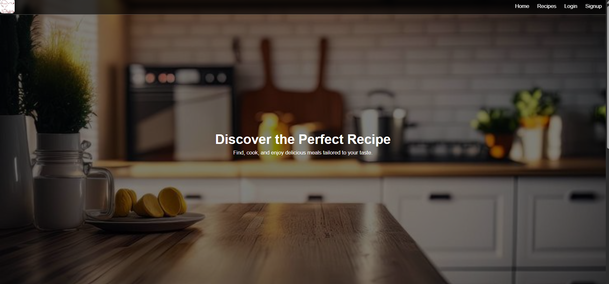
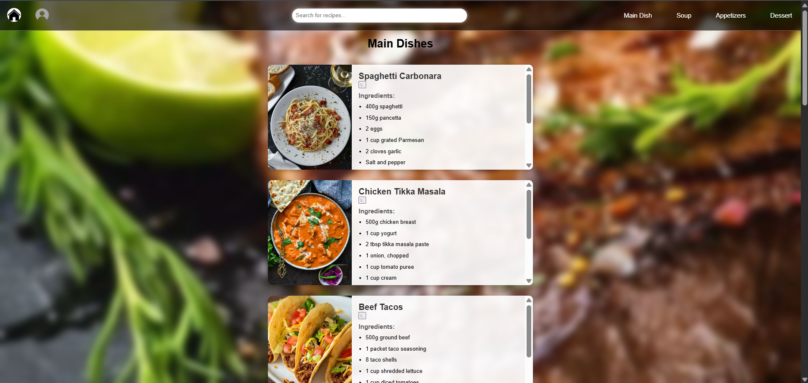
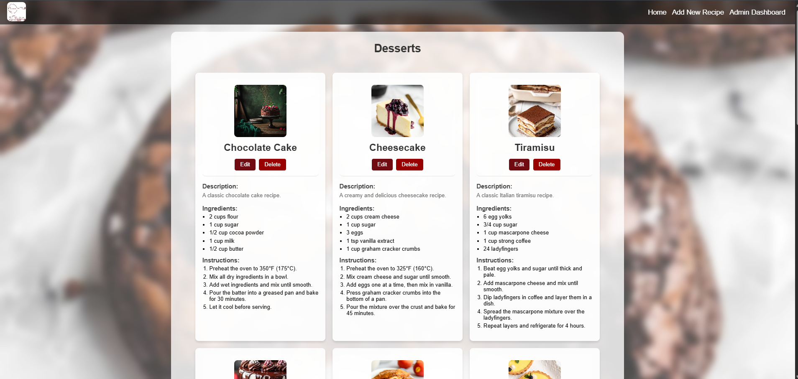

# Recipe Finder Website

Recipe Finder is a full-stack Django web application that helps users explore and manage a variety of recipes. The system supports both regular users and admin roles, offering features for browsing, saving, and managing recipes categorized by cuisine and dish type.

## Project Overview

Recipe Finder is a full-stack web application built using Django and SQL Server. The platform is designed to help users explore, discover, and save recipes from a wide variety of cuisines and categories. It also includes a robust admin panel that allows authorized administrators to manage recipes, cuisines, categories, and user data.

This system was created to serve as both a recipe recommendation platform and a learning project for implementing full-stack development principles using Django with SQL Server as the backend.

The platform is structured to support two user roles:
- **Regular Users**: who can sign up, browse and favorite recipes, and manage their personal profiles.
- **Admins**: who have access to a management dashboard for controlling the recipe content and overseeing user interactions.

### Objectives

- Provide a user-friendly interface to browse categorized recipes.
- Implement dynamic filtering by cuisine and dish type.
- Allow users to personalize their experience with favorites and profile images.
- Create a secure, admin-only dashboard for managing content.

### Key Functional Highlights

- Filter recipes by both **cuisine** (Egyptian, Indian, Italian, Mexican) and **dish type** (Main Dish, Soup, Appetizers, Dessert).
- Store and display recipes with:
  - Title
  - Description
  - Ingredients (multi-line)
  - Steps
  - Optional image
- Role-based access:
  - Admin login verification via `admin_id`
  - Separate user/admin interface logic
- Uploadable profile pictures and recipe images
- Data stored in **SQL Server** via Django's ORM

## Features

### User Features
- User registration and login with role selection (user or admin)
- Browse recipes by cuisine: Egyptian, Italian, Indian, Mexican
- Filter recipes by category: Main Dish, Soup, Appetizers, Dessert
- Save recipes as favorites
- Edit user profile and upload profile photo

### Admin Features
- Secure login with admin ID verification
- Add, edit, and delete recipes
- Manage recipe categories and cuisines
- View and manage users and their favorite recipes

## Technologies Used

| Layer     | Technology                      |
|-----------|----------------------------------|
| Backend   | Django (Python)                 |
| Database  | SQL Server (Windows Authentication) |
| Frontend  | HTML, CSS, JavaScript          |
| Media     | Django `ImageField` for photo uploads |
| Auth      | Django sessions with custom user roles |

## Going Through the Website

This section provides a visual walkthrough of the key features and pages in the Recipe Finder website.

---

### Homepage

The homepage welcomes users with a clean interface. It allows browsing by cuisine and category, encouraging exploration through an intuitive layout.

---

### User Page

The profile page enables users to manage their personal information, update profile photos, and view saved favorite recipes.

---

### Admin Dashboard

The admin dashboard is restricted to admin users. It provides full control over managing recipes, users, and recipe categories or cuisines.

---

